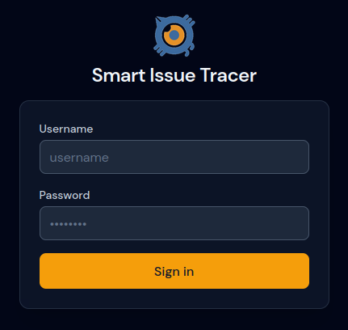
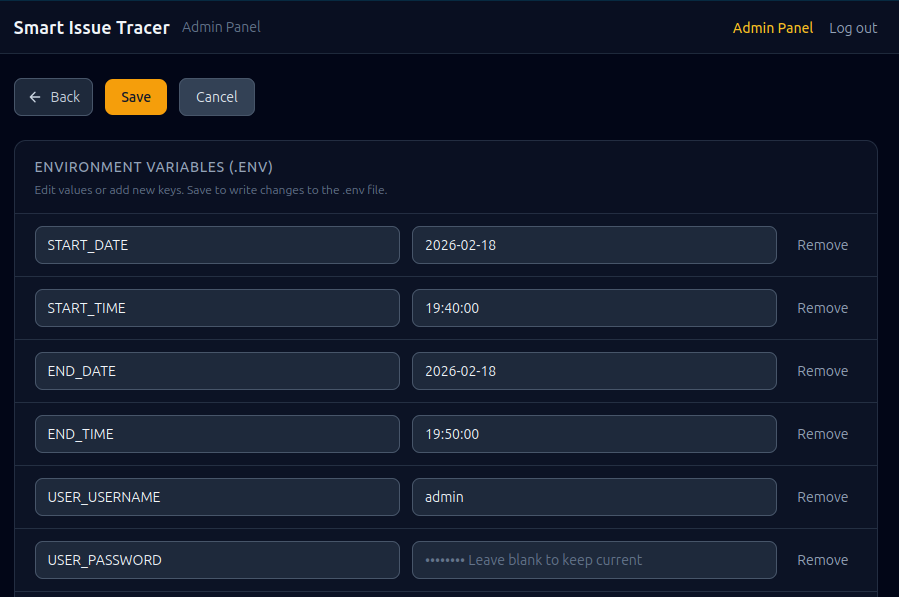
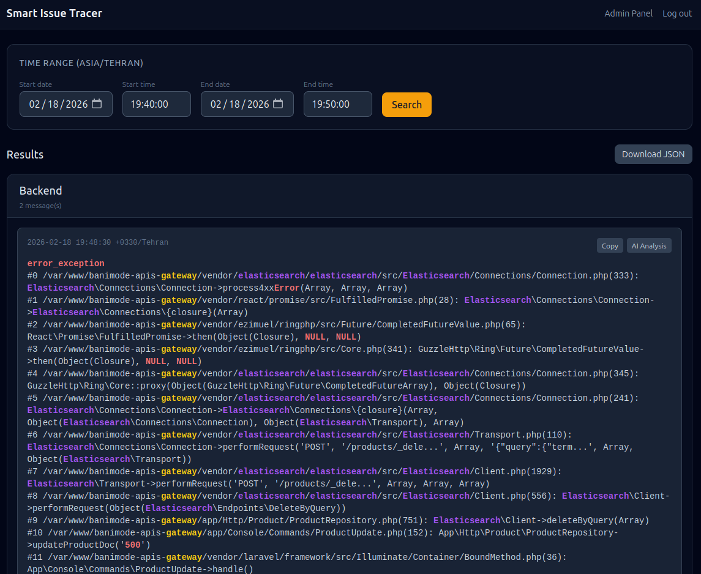
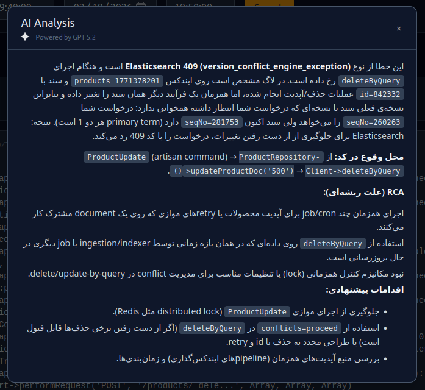

# Smart Issue Tracer

Searching and analyzing Graylog logs, run queries and get AI-powered RCA on selected Erros.

## Quick start

```bash
cp example.env .env
# Edit .env with your credentials and Graylog/AI settings
docker compose up --build
```

Open http://localhost:5000 and log in with `USER_USERNAME` / `USER_PASSWORD`.

## Configuration (`example.env`)

Copy `example.env` to `.env` and adjust. Parameters:

### Time range (defaults, Asia/Tehran)

| Variable    | Description                          |
|------------|--------------------------------------|
| `START_DATE` | Default search start date (YYYY-MM-DD). |
| `START_TIME` | Default start time (HH:MM or HH:MM:SS). |
| `END_DATE`   | Default search end date.             |
| `END_TIME`   | Default end time.                    |

### App login

| Variable       | Description                    |
|----------------|--------------------------------|
| `USER_USERNAME` | Login username for the web app. |
| `USER_PASSWORD` | Login password.               |

### Graylog

| Variable | Description |
|----------|-------------|
| `GRAYLOG_DOMAIN` | Graylog base URL (e.g. `https://gray.example.com`). |
| `GRAYLOG_USERNAME` | Graylog API username. |
| `GRAYLOG_PASSWORD` | Graylog API password. |

### Graylog query sets (JSON arrays of query strings)

| Variable | Description |
|----------|-------------|
| `GRAYLOG_QUERIES_BACKEND_MOBAPI` | Queries for backend/mobapi logs. |
| `GRAYLOG_QUERIES_FRONTEND_NEXTJS` | Queries for frontend Next.js logs. |
| `GRAYLOG_QUERIES_FRONTEND_NEXTJS_PODS` | Queries for frontend Next.js pod logs. |
| `GRAYLOG_QUERIES_FRONTEND_NEXTJS_PODS_TIME_FRAME` | Time frame for pod queries (e.g. `10s`). |

### Graylog output and filtering

| Variable | Description |
|----------|-------------|
| `GRAYLOG_OUTPUT_FIELDS` | JSON array of field names to include per message. |
| `GRAYLOG_FILTER_KEYWORDS` | JSON array of keywords; messages containing any (case-insensitive) are excluded. |

### Highlight words (JSON arrays, shown in red / yellow / special / success)

| Variable | Description |
|----------|-------------|
| `HIGHLIGHT_ERROR_WORDS` | Words highlighted as error (red). |
| `HIGHLIGHT_WARNING_WORDS` | Words highlighted as warning (yellow). |
| `HIGHLIGHT_SPECIAL_WORDS` | Words highlighted as special. |
| `HIGHLIGHT_SUCCESS_WORDS` | Words highlighted as success. |

### AI (optional RCA)

| Variable | Description |
|----------|-------------|
| `AI_HOST` | AI API base URL (e.g. OpenAI-compatible). |
| `AI_API_KEY` | API key for the AI service. |
| `AI_MODEL` | Model name. |
| `AI_SYSTEM_PROMPT` | System prompt for analysis (e.g. “Analyze and provide RCA in Persian”). |

## Screenshots

| Login | Admin panel |
|-------|-------------|
|  |  |

| Main app | |
|----------|---|
|  |  |
